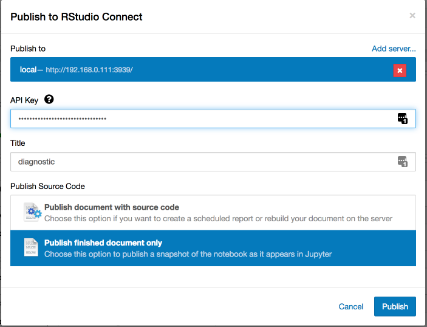

[`rsconnect`](https://www.github.com/rstudio/rsconnect-jupyter/) is a
plugin for [Jupyter Notebook](https://jupyter.org/) that enables
publishing notebooks to [RStudio
Connect](https://www.rstudio.com/products/connect/).

# Requirements

- Python 2.7 or Python 3.4 and higher
- Jupyter Notebook 5.x
- `pip`
- [`wheel`](https://pypi.org/project/wheel/)

If using `conda`, `pip` and `wheel` should already be installed.

# Installation

Download the `rsconnect` python package from
[here](https://github.com/rstudio/rsconnect-jupyter/releases)
(packaged as a [wheel](https://pythonwheels.com/) file).

We recommend working within a `virtualenv` (especially on Mac).  If you
are unfamiliar, these commands create and activate a `virtualenv`
at `/my/path`:

```
pip install virtualenv
virtualenv /my/path
cd /my/path
source bin/activate
```

Install the `rsconnect` package with the following command:

```
pip install rsconnect-1.1.0-py2.py3-none-any.whl
```

Enable the `rsconnect` extension with the following commands:

```
# Install `rsconnect` as a jupyter extension
jupyter-nbextension install --sys-prefix --py rsconnect

# Enable JavaScript extension
jupyter-nbextension enable --sys-prefix --py rsconnect

# Enable Python extension
jupyter-serverextension enable --sys-prefix --py rsconnect
```

Note: The above commands only need to be run once when installing
`rsconnect`.

Note: If you run into an issue during installation please let us know by filing
a bug [here](https://github.com/rstudio/rsconnect-jupyter/issues).

# Uninstalling

First disable and remove the `rsconnect` notebook extension:

```
# Disable Python extensions found in `rsconnect`
jupyter-serverextension disable --sys-prefix --py rsconnect

# Remove JavaScript extension
jupyter-nbextension uninstall --sys-prefix --py rsconnect
```

Finally, uninstall the `rsconnect` python package:

```
pip uninstall rsconnect
```

# Upgrading

To upgrade `rsconnect`, first uninstall the extension and then
re-install it.

# Usage

Open a notebook and click the blue "Publish to RStudio Connect" icon
to publish the current notebook to RStudio Connect.


### Entering server information

If this is your first time publishing this notebook, you will be
prompted to enter the location and a nickname for the RStudio Connect
server.


### Publishing options

You will be prompted to enter your API Key, which will be used to publish
the notebook under your account to the selected RStudio Connect server.

See the [RStudio Connect User
Guide](http://docs.rstudio.com/connect/user/api-keys.html) for
instructions on generating API Keys for your user.



There are two different publication modes. Selecting "Publish finished document only" will publish an HTML snapshot of the notebook to RStudio Connect. HTML snapshots are static and cannot be scheduled or re-run on the RStudio Connect server.

If you select "Publish document with source code", the notebook file and a list of the Python packages installed in your environment will be sent to RStudio Connect. This enables RStudio Connect to recreate the environment and re-run the notebook at a later time.

#### Environment detection with pip

The list of packages sent along with the notebook comes from the python environment where the notebook kernel is running. In order for environment inspection to work, the `rsconnect` package must be installed in the kernel environment; that is, the environment where the `ipykernel` package is installed. In most cases that will be the same as the notebook server environment where `jupyter` is installed.

If there is a `requirements.txt` file in the same directory as the notebook file, its contents will be used. This allows you to directly control which packages will be installed on the RStudio Connect server before the notebook is rendered. If you use this option, you must ensure that all necessary packages are listed in the `requirements.txt` file.

If there isn't a requirements file, the command `pip freeze` will be used to inspect the environment. The output of `pip freeze` lists all packages currently installed, as well as their versions, which enables RStudio Connect to recreate the same environment.


### Handling conflicts
If content that matches your notebook's title is found on RStudio Connect, you
may choose to overwrite the existing content or create new content.


Choosing "New location" will create a new document in RStudio Connect. You can choose either publication mode - an HTML snapshot or a document with source code.

Updating an existing document will not change its publication mode.


Upon successful publishing of the document a notification will be
shown in toolbar.  Clicking the notification will open the published
document in the RStudio Connect server you selected in the previous
dialog.


# Collaboration

To collaborate with others add them as collaborators in RStudio Connect. During
publishing they should provide their API key and will be able to choose a
content location to publish to if the notebook title is the same.

You may share notebooks if appropriate.

# Installation in JupyterHub

In JupyterHub, install the `rsconnect` package into the environment where the Jupyter notebook server and kernel are installed. Typically those will be the same environment. If you've configured separate kernel environments, install the `rsconnect` package in the notebook server environment as well as each kernel environment.

## JupyterHub Example Configuration

This example uses the Jupyterhub docker image as a base and installs the `rsconnect` package:

```
FROM jupyterhub/jupyterhub

# Install Jupyter notebook into the existing base conda environment
RUN conda install notebook

# Download and install rsconnect in the same environment
# Update this to specify the desired version of the rsconnect package,
# or pass `--build-arg RSCONNECT_VERSION=...` to docker build.
ARG RSCONNECT_VERSION=1.1.0.64
ARG REPOSITORY=https://s3.amazonaws.com/rstudio-rsconnect-jupyter

RUN wget ${REPOSITORY}/rsconnect-${RSCONNECT_VERSION}-py2.py3-none-any.whl
RUN pip install rsconnect-${RSCONNECT_VERSION}-py2.py3-none-any.whl && \
	jupyter-nbextension install --sys-prefix --py rsconnect && \
	jupyter-nbextension enable --sys-prefix --py rsconnect && \
	jupyter-serverextension enable --sys-prefix --py rsconnect

RUN jupyterhub --generate-config

# create test users
RUN useradd -m -s /bin/bash user1 && \
	useradd -m -s /bin/bash user2 && \
	useradd -m -s /bin/bash user3 && \
	bash -c 'echo -en "password\npassword" | passwd user1' && \
	bash -c 'echo -en "password\npassword" | passwd user2' && \
	bash -c 'echo -en "password\npassword" | passwd user3'

CMD ["jupyterhub"]
```

Run these commands to build and start the container:
```
docker build -t jupyterhub:rsconnect .
docker run --rm -p 8000:8000 --name jupyterhub jupyterhub:rsconnect
```

Connect to Jupyterhub on http://localhost:8000 and log in as one of the test users. From there, you can create a notebook and publish it to RStudio Connect. Note that the current Jupyterhub docker image uses Python 3.6.5, so you will need a compatible Python version installed on your RStudio Connect server.
