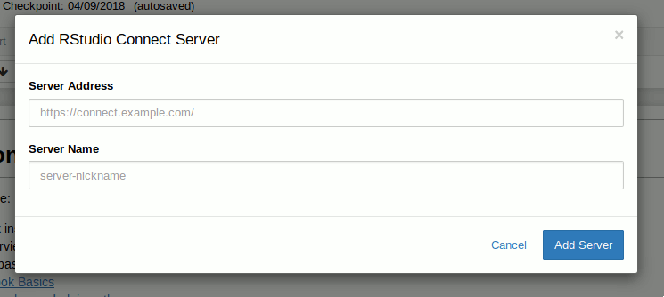
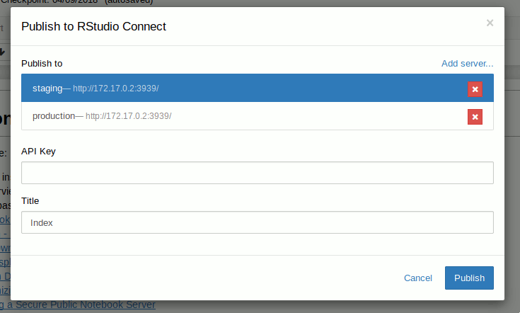
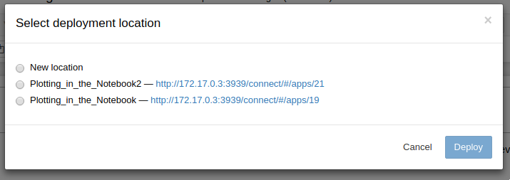

[`rsconnect`](https://www.github.com/rstudio/rsconnect-jupyter/) is a
plugin for [Jupyter Notebook](https://jupyter.org/) that enables
publishing notebook renders (HTML) to [RStudio
Connect](https://www.rstudio.com/products/connect/).

# Requirements

- Python 2.7 or Python 3.4 and higher
- Jupyter Notebook 5.x
- `pip`
- [`wheel`](https://pypi.org/project/wheel/)

If using `conda`, `pip` and `wheel` should already be installed.

# Installation

Download the `rsconnect` python package from
[here](https://github.com/rstudio/rsconnect-jupyter/releases)
(packaged as a [wheel](https://pythonwheels.com/) file).

Install the `rsconnect` package with the following command:

```
pip install rsconnect-0.1.0-py2.py3-none-any.whl
```

Enable the `rsconnect` extension with the following commands:

```
# Install `rsconnect` as a jupyter extension for your user. If you wish
# to allow the extension to be available for all users who access
# Jupyter Notebooks, remove the `--user` flag
jupyter-nbextension install --user --py rsconnect

# Enable JavaScript extension
jupyter-nbextension enable --py rsconnect

# Enable Python extension
jupyter-serverextension enable --py rsconnect
```

Note: The above commands only need to be run once when installing
`rsconnect`.

Note: If using multiple installations of Jupyter Notebook on a system, extension
configuration information (available/enabled status) will be shared since
Jupyter Notebook stores this data in the users `$HOME` directory. This is a
known limitation of Jupyter Notebook.

Note: If you run into an issue during installation please do let us know.

# Uninstalling

First disable and remove the `rsconnect` notebook extension:

```
# Disable Python extensions found in `rsconnect`
jupyter-serverextension disable --py rsconnect

# Remove JavaScript extension
jupyter-nbextension uninstall --py rsconnect
```

Finally, uninstall the `rsconnect` python package:

```
pip uninstall rsconnect
```

# Upgrading

To upgrade `rsconnect`, first uninstall the extension and then
re-install it.

# Usage

Open a notebook and click the blue "Publish to RStudio Connect" icon
to publish the current notebook to RStudio Connect.


If this is your first time publishing this notebook, you will be
prompted to enter the location and a nickname for the RStudio Connect
server.



You will then be prompted to enter your API Key which will be used to publish
the notebook under your account to the selected RStudio Connect server.

See the [RStudio Connect User
Guide](http://docs.rstudio.com/connect/user/api-keys.html) for
instructions on generating API Keys for your user.



If content that matches your notebook's title is found on RStudio Connect, you
may choose to overwrite the existing content or create new content.



Upon successful publishing of the document a notification will be
shown in toolbar.  Clicking the notification will open the published
document in the RStudio Connect server you selected in the previous
dialog.


# Collaboration

To collaborate with others add them as collaborators in RStudio Connect. During
publishing they should provide their API key and will be able to choose a
content location to publish to if the notebook title is the same.

You may share notebooks if appropriate.
