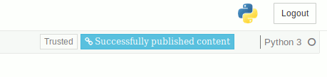

[`rsconnect`](https://www.github.com/rstudio/rsconnect-jupyter/) is a
plugin for [Jupyter Notebook](https://jupyter.org/) that enables
publishing of notebooks to [RStudio
Connect](https://www.rstudio.com/products/connect/).

# Requirements

- Python 2.7 or Python 3.4 and higher
- Jupyter Notebook 5.x
- `pip`
- [`wheel`](https://pypi.org/project/wheel/)

If using `conda`, `pip` and `wheel` should already be installed.

# Installation

Download the `rsconnect` python package from
[here](https://github.com/rstudio/rsconnect-jupyter/releases)
(packaged as a [wheel](https://pythonwheels.com/) file).

Install the `rsconnect` package with the following command:

```
pip install rsconnect-0.1.0-py2.py3-none-any.whl
```

Enable the `rsconnect` extension with the following commands:

```
# Install `rsconnect` as a jupyter extension for your user. If you wish
# to allow the extension to be available for all users who access
# jupyter, remove the `--user` flag
jupyter-nbextension install --user --py rsconnect

# Enable JavaScript extension
jupyter-nbextension enable --py rsconnect

# Enable Python extension
jupyter-serverextension enable --py rsconnect
```

# Usage

Open a notebook and click the blue "Publish to RStudio Connect" icon
to publish the current notebook to RStudio Connect.


If this is your first time publishing this notebook, you will be
prompted to enter the location and a nickname for the RStudio Connect
server.


You will then be prompted to enter your API Key which will be used to
publish the notebook under your account to the selected RStudio
Connect server.

See the [RStudio Connect User
Guide](http://docs.rstudio.com/connect/user/api-keys.html) for
instructions on generating API Keys for your user.


Upon successful publishing of the document a notification will be
shown in toolbar.  Clicking the notification will open the published
document in the RStudio Connect server you selected in the previous
dialog.


