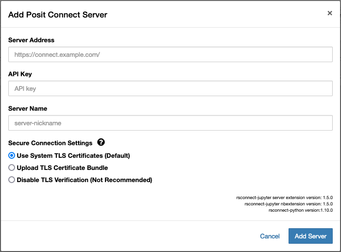
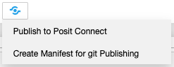
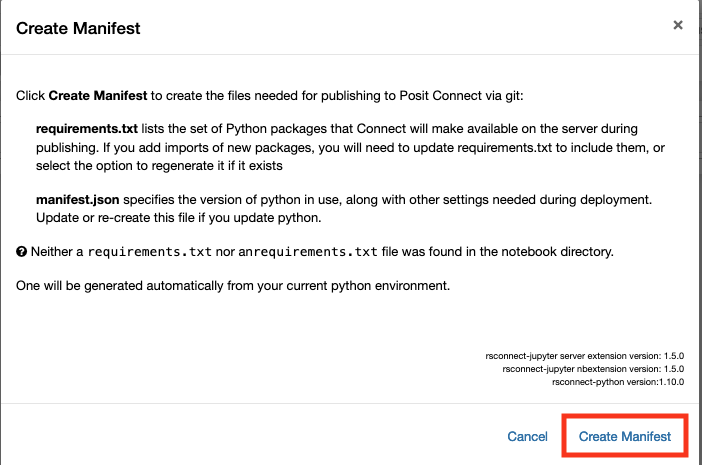

# `rsconnect-jupyter` User Guide

`rsconnect-jupyter` is a plugin for Jupyter Notebooks that enables publishing notebooks to RStudio Connect.

## Requirements

- Python 2.7.9 or Python 3.5.0 and higher
- Jupyter Notebook 5.x
- [pip](https://pypi.org/project/pip/)
- [wheel](https://pypi.org/project/wheel/)
- [RStudio Connect](https://www.rstudio.com/products/connect/download-commercial/) v1.7.0 or higher, configured with Python support

!!! note
    If using `conda`, `pip` and `wheel` should already be installed.

## Installation

- If you are installing `rsconnect-jupyter` for use in Jupyterhub, please see
the [Installation in Jupyterhub](#installation-in-jupyterhub) section below.
- If you are installing `rsconnect-jupyter` to Jupyter running on RStudio Server Pro, see
the [RStudio Server Pro documentation on Jupyter Notebooks](https://docs.rstudio.com/rsp/integration/jupyter-standalone/#4-install-jupyter-notebooks-jupyterlab-and-python-packages)
for instructions on installing the plugin to the right location.
- Otherwise, we recommend using Jupyter within a virtual environment using
`virtualenv`. See the [Running Jupyter in a virtualenv](#running-jupyter-in-a-virtualenv), shown below,  for instructions
on setting up a `virtualenv`, or read more at the
[virtualenv documentation](https://virtualenv.pypa.io/en/latest/).

The following commands should be run after activating the Python environment where you plan to use `jupyter`.

- Install the `rsconnect-jupyter` package with the following command:
  <div class="code-title">Terminal</div>
  ```bash
  pip install rsconnect_jupyter
  ```

- Enable the `rsconnect-jupyter` extension with the following commands:
  <div class="code-title">Terminal</div>
  ```bash
  # Install `rsconnect-jupyter` as a jupyter extension
  jupyter-nbextension install --sys-prefix --py rsconnect_jupyter

  # Enable JavaScript extension
  jupyter-nbextension enable --sys-prefix --py rsconnect_jupyter

  # Enable Python extension
  jupyter-serverextension enable --sys-prefix --py rsconnect_jupyter
  ```

!!! note
    - The above commands only need to be run once when installing `rsconnect_jupyter`.
    - In order to deploy content, you will need at least the [rsconnect-python](https://github.com/rstudio/rsconnect-python) package in every kernel you plan to deploy from.
    - If you run into an issue during installation, please let us know by filing a bug [here](https://github.com/rstudio/rsconnect-jupyter/issues).
  
### Running Jupyter in a virtualenv

- These commands create and activate a `virtualenv` at `/my/path`:
  <div class="code-title">Terminal</div>
  ```bash
  pip install virtualenv
  virtualenv /my/path
  source /my/path/bin/activate
  ```

!!! tip 
    Running `source /my/path/bin/activate` activates the virtual environment. While the `virtualenv` is active, Python-related commands like `python`, `pip`, and `jupyter` will use to copies located inside the virtual environment. You can check which copy of `python` you're using by running `which python`.

- Install Jupyter inside the `virtualenv`:
  <div class="code-title">Terminal</div>
  ```bash
  pip install jupyter
  ```

- [Install rsconnect-python](#installation) with your virtual environment active to install and activate the plugin for that copy of Jupyter.

    !!! note
        Be sure to run Jupyter from this virtual environment, not from
        another installation, or the `rsconnect-python` extension will
        not be available. To do so, you will need to activate the virtual
        environment in each new terminal session before you run `jupyter`.

## Upgrading

To upgrade `rsconnect-jupyter`:

- First, uninstall the extension.
- Then, re-install it.

## Usage

To publish to RStudio Connect:

- Open a notebook.
- Click the  icon (blue publish icon) and select `Publish to RStudio Connect`
to publish the current notebook to RStudio Connect.

### Entering server information

- If this is your first time publishing a notebook, you will be
prompted to enter the location and a nickname for the RStudio Connect server.
- You will also be prompted to enter your API Key. See the [RStudio Connect User
Guide](http://docs.rstudio.com/connect/user/api-keys.html) for
instructions on generating API Keys for your user.
- When you click the **Add Server** button, `rsconnect-jupyter` will send a request to the RStudio Connect server to verify that it can be reached via the requested URL and that the API key is valid.

If your RStudio Connect server was configured with a self-signed certificate (or other certificate that computer hosting your Jupyter notebook server does not trust), the attempt to contact RStudio Connect may fail with a TLS-related error.

You have multiple options in this case, depending on your needs:

1. If your RStudio Connect Administrator can give you the Certificate Authority (CA)
 Bundle for your RStudio Connect server, ask your Jupyter Administrator if it
 can be added to the trusted system store.
1. If the CA Bundle cannot be added to the trusted system store, you may select
 `Upload TLS Certificate Bundle` to upload the bundle to Jupyter, which will verify
 your secure connection to RStudio Connect.
1. If you cannot obtain the CA bundle, you can disable TLS verification completely
 by selecting the `Disable TLS Certificate Verification` box. Your connection to
 RStudio Connect will still be encrypted, but you will not be able to verify the
 identity of the RStudio Connect server.



### Publishing options


There are two different publication modes. Selecting **Publish finished document only** will 
publish an HTML snapshot of the notebook to RStudio Connect. HTML snapshots are static and 
cannot be scheduled or re-run on the RStudio Connect server.

If you select **Publish document with source code**, the notebook file and a list of the Python 
packages installed in your environment will be sent to RStudio Connect. This enables RStudio 
Connect to recreate the environment and re-run the notebook at a later time.

#### Additional Files

If your notebook needs some external file in order to render, add the file using the 
**Select Files** button. You can select any file within the notebook folder. However,
these files may not be made available to users after render.

#### Environment detection with pip

The list of packages sent along with the notebook comes from the python
environment where the notebook kernel is running. In order for environment
inspection to work, the `rsconnect-jupyter` package must be installed in the
kernel environment; that is, the environment where the `ipykernel` package is
installed. In most cases that will be the same as the notebook server
environment where `jupyter` is installed.

The command `pip freeze` will be used to inspect the environment. The output
of `pip freeze` lists all packages currently installed, as well as their
versions, which enables RStudio Connect to recreate the same environment.

### Generating Manifests for git Publishing

RStudio Connect can poll git repositories for deployable content and update
as you add new commits to your repository. In order to be deployable, a
directory must have a valid `manifest.json`. Python content should also have
some kind of environment file (i.e.: `requirements.txt`) in order to be able
to restore the package set in your current environment.



To begin, select `Create Manifest for git Publishing`.



When you click **Create Manifest**, one of the following will happen:

- If a `manifest.json` and `requirements.txt` does not exist, they will be generated for the current notebook using your current environment.
- If they do exist, you will be presented with a message
informing you of this fact. If you need to regenerate the files, delete them in the Jupyter UI or using the console, then repeat this process.

For more information on git publishing, see the 
[RStudio Connect User Guide](https://docs.rstudio.com/connect/user/git-backed.html#git-backed-publishing).

### Handling conflicts

If content that matches your notebook's title is found on RStudio Connect, you
may choose to overwrite the existing content or create new content.


- Choosing **New location** creates a new document in RStudio Connect.
- You can choose either publication mode:
    - an HTML snapshot *or* 
    - a document with source code

Updating an existing document will not change its publication mode.

Upon successful publishing of the document a notification will be
shown in toolbar. Clicking the notification will open the published
document in the RStudio Connect server you selected in the previous
dialog.


## Collaboration

To collaborate with others add them as collaborators in RStudio Connect. During
publishing they should provide their API key and will be able to choose a
content location to publish to if the notebook title is the same.

You may share notebooks if appropriate.

## Installation in JupyterHub

In JupyterHub, follow the directions [above](#installation) to install the
`rsconnect-jupyter` package into the Python environment where the Jupyter
notebook server and kernel are installed. Typically those will be the same
environment. If you've configured separate kernel environments, install the
`rsconnect-jupyter` package in the notebook server environment as well as each
kernel environment.

The exact install location depends on your Jupyterhub configuration.

### JupyterHub Example Configuration

This section presents a simple working example of a Jupyterhub configuration
with `rsconnect-jupyter` installed.

This example uses Docker, but you can install the `rsconnect-jupyter` package in
any Jupyterhub installation. Docker is not required.

Example Dockerfile:

<p class="code-title">Dockerfile</p>
```dockerfile
FROM jupyterhub/jupyterhub:0.9.4

# Install Jupyter notebook into the existing base conda environment
RUN conda install notebook

# Download and install rsconnect-jupyter in the same environment
# Update this to specify the desired version of the rsconnect-jupyter package,
# or pass `--build-arg VERSION=...` to docker build.
ARG VERSION=RSCONNECT_VERSION
ARG REPOSITORY=https://s3.amazonaws.com/rstudio-rsconnect-jupyter

RUN wget ${REPOSITORY}/rsconnect_jupyter-${VERSION}-py2.py3-none-any.whl
RUN pip install rsconnect_jupyter-${VERSION}-py2.py3-none-any.whl && \
    jupyter-nbextension install --sys-prefix --py rsconnect_jupyter && \
    jupyter-nbextension enable --sys-prefix --py rsconnect_jupyter && \
    jupyter-serverextension enable --sys-prefix --py rsconnect_jupyter

# create test users
RUN useradd -m -s /bin/bash user1 && \
    useradd -m -s /bin/bash user2 && \
    useradd -m -s /bin/bash user3 && \
    bash -c 'echo -en "password\npassword" | passwd user1' && \
    bash -c 'echo -en "password\npassword" | passwd user2' && \
    bash -c 'echo -en "password\npassword" | passwd user3'

CMD ["jupyterhub"]
```

Run these commands to build and start the container:

<p class="code-title">Terminal</p>
```bash
docker build -t jupyterhub:rsconnect-jupyter .
docker run --rm -p 8000:8000 --name jupyterhub jupyterhub:rsconnect-jupyter
```

Connect to Jupyterhub on http://localhost:8000 and log in as one of the test
users. From there, you can create a notebook and publish it to RStudio Connect.
Note that the current Jupyterhub docker image uses Python 3.6.5, so you will
need a compatible Python version installed on your RStudio Connect server.

## Uninstalling

- First disable and remove the `rsconnect-jupyter` notebook extension:
  <div class="code-title">Terminal</div>
  ```bash
  # Disable Python extensions found in `rsconnect-jupyter`
  jupyter-serverextension disable --sys-prefix --py rsconnect_jupyter

  # Remove JavaScript extension
  jupyter-nbextension uninstall --sys-prefix --py rsconnect_jupyter
  ```

- Finally, uninstall the `rsconnect-jupyter` python package:
  <div class="code-title">Terminal</div>
  ```bash
  pip uninstall rsconnect_jupyter
  ```


## Related Documentation

For a step-by-step guide for creating and publishing a new Jupyter Notebook to
RStudio Connect, view our [How To](https://docs.rstudio.com/how-to-guides/users/basic/publish-jupyter-notebook/).