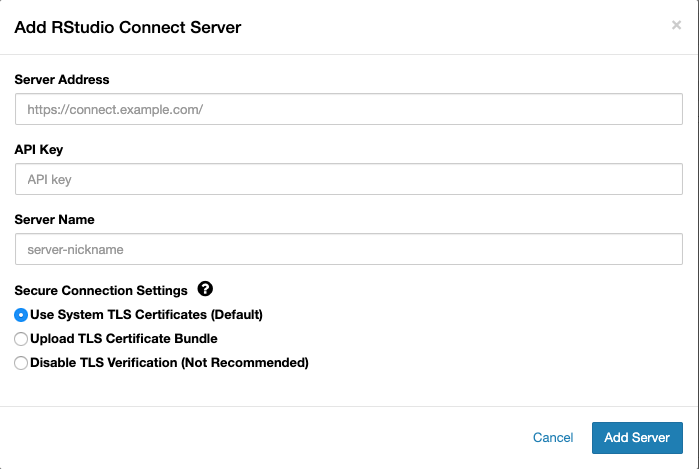
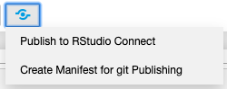
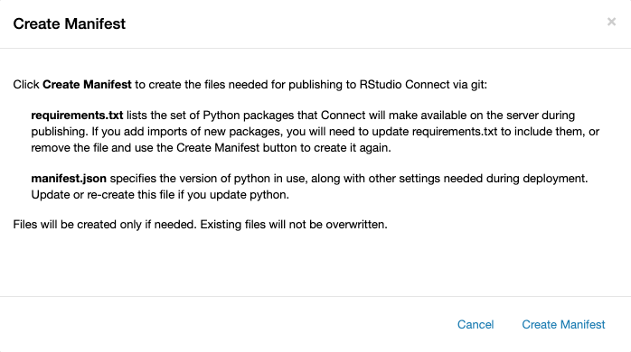

# Usage

## Publish to RStudio Connect

To publish to RStudio Connect:

- Open a Jupyter notebook.
- Click the  icon (blue publish button) and select **Publish to RStudio Connect**
to publish the current notebook to RStudio Connect.

!!! note
    This plugin is only for notebooks using Python kernels. Therefore, R notebooks cannot be published using this plugin.

## Entering server information

- If this is your first time publishing a notebook, you will be
prompted to enter the location and a nickname for the RStudio Connect server.
- You will also be prompted to enter your API Key. See the [RStudio Connect User
Guide](http://docs.rstudio.com/connect/user/api-keys) for
instructions on generating API Keys for your user.
- When you click the **Add Server** button, `rsconnect-jupyter` will send a request to the RStudio Connect server to verify that it can be reached via the requested URL and that the API key is valid.

If your RStudio Connect server was configured with a self-signed certificate (or other certificates that the computer hosting your Jupyter notebook server does not trust), the attempt to contact RStudio Connect may fail with a TLS-related error.

You have multiple options in this case, depending on your needs:

1. If your RStudio Connect Administrator can give you the Certificate Authority (CA)
 Bundle for your RStudio Connect server, ask your Jupyter Administrator if it
 can be added to the trusted system store.
1. If the CA Bundle cannot be added to the trusted system store, you may select
 **Upload TLS Certificate Bundle** to upload the bundle to Jupyter, which will verify
 your secure connection to RStudio Connect.
1. If you cannot obtain the CA bundle, you can disable TLS verification completely
 by selecting the **Disable TLS Certificate Verification** check box. Your connection to
 RStudio Connect will still be encrypted, but you will not be able to verify the
 identity of the RStudio Connect server.

## Publishing options

There are two different publication modes:

- If you select **Publish document with source code**, the notebook file and a list of the Python 
packages installed in your environment will be sent to RStudio Connect. This enables RStudio 
Connect to recreate the environment and re-run the notebook at a later time.
- Selecting **Publish finished document only** will 
publish an HTML snapshot of the notebook to RStudio Connect. HTML snapshots are static and 
cannot be scheduled or re-run on the RStudio Connect server.

### Additional Files

If your notebook needs some external file to render, add the file using the 
**Select Files...** button. You can select any file within the notebook folder. However,
these files may not be made available to users after render.

### Environment detection with pip

The list of packages sent along with the notebook comes from the python
environment where the notebook kernel is running. For environment
inspection to work, the `rsconnect-jupyter` package must be installed in the
kernel environment; that is, the environment where the `ipykernel` package is
installed. In most cases that will be the same as the notebook server
environment where `jupyter` is installed.

The command `pip freeze` will be used to inspect the environment. The output
of `pip freeze` lists all packages currently installed, as well as their
versions, which enables RStudio Connect to recreate the same environment.

## Generating Manifests for git Publishing

RStudio Connect can poll git repositories for deployable content and update
as you add new commits to your repository. To be deployable, a
directory must have a valid `manifest.json`. Python content should also have
some kind of environment file (i.e.: `requirements.txt`) to be able
to restore the package set in your current environment.

To begin, click the **Publish** button and select **Create Manifest for git Publishing**.

When you click **Create Manifest**, one of the following will happen:

- If a `manifest.json` and `requirements.txt` file does not exist, they will be generated for the current notebook using your current environment.
- If they do exist, you will be presented with a message
informing you of this fact. If you need to regenerate the files, delete them in the Jupyter UI or using the console, then repeat this process.

For more information on git publishing, see the 
[RStudio Connect User Guide](https://docs.rstudio.com/connect/user/git-backed#git-backed-publishing).

## Handling conflicts

If content that matches your notebook's title is found on RStudio Connect, you
may choose to overwrite the existing content or create new content.

- Choosing **New location** creates a new document in RStudio Connect.
- You can choose either publication mode:
    - an HTML snapshot *or* 
    - a document with source code

Updating an existing document will not change its publication mode.

Upon successful publishing of the document, a notification will be
shown in the toolbar. 

Clicking the notification will open the published
document in the RStudio Connect server you selected in the previous
dialog.

